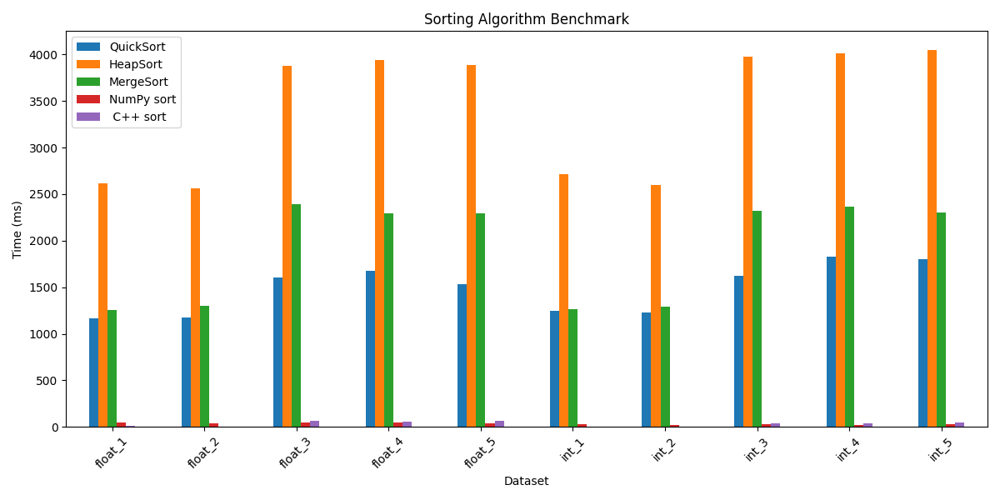

# Sorting Algorithm Benchmark

## Overview
This project compares the performance of different sorting algorithms on datasets of ~1,000,000 elements.

Algorithms tested:
- QuickSort (custom)
- HeapSort (custom)
- MergeSort (custom)
- NumPy sort (Python)
- std::sort (C++)

---

## Dataset
- 10 datasets
- 5 float64 arrays
- 5 int32 arrays
- Includes sorted, reverse-sorted, and random data

---

## Project Structure

src/ → source code (Python & C++)
scripts/ → dataset generation
results/ → benchmark results & chart
report/ → final PDF report

---

## How to Run

### 1️⃣ Generate data
- .npy  
python scripts/randomarray.py
- convert .npy to .bin  
python scripts/convert.py

### 2️⃣ Run Python benchmark

python src/benchmark.py

### 3️⃣ Compile & run C++ benchmark

g++ -O3 -march=native -std=c++17 src/benchmark_cpp.cpp -o benchmark_cpp
./benchmark_cpp

---

## Summary of Results

| Algorithm   | Sorted Data | Random Data |
|-------------|------------|------------|
| std::sort   | ~4–6 ms    | ~41–62 ms  |
| NumPy sort  | ~23–48 ms  | ~23–43 ms  |
| QuickSort   | ~1100+ ms  | ~1100+ ms  |
| MergeSort   | ~1200+ ms  | ~1200+ ms  |
| HeapSort    | ~2600+ ms  | ~2600+ ms  |

---

## Conclusion
Standard library implementations significantly outperform custom implementations.  
Compiler optimization (`-O3 -march=native`) has a major impact on performance.

---

Student project – Data Structures and Algorithms